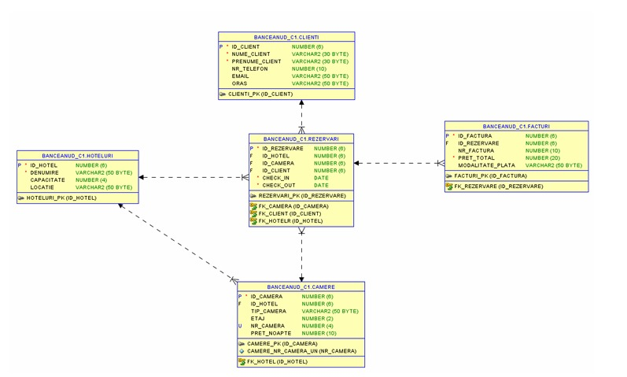

# Hotel Chain Database Management System

This project was developed as part of my Oracle Database Management Systems coursework. The main objective was to design and implement a relational database for managing the activity of a hotel chain.

The database stores information about hotels, rooms, customers, reservations and invoices, allowing different operations related to bookings and financial data.

## Technologies

- Oracle SQL
- PL/SQL
- Oracle SQL Developer

## Database Structure

The database contains five main tables:

- `HOTELURI` – information about hotels, capacity and location
- `CAMERE` – rooms, room types and nightly rates
- `CLIENTI` – customer information
- `REZERVARI` – reservations and stay periods
- `FACTURI` – invoices, total values and payment methods

The tables are connected using primary and foreign keys.



## What I worked on

During this project, I created and populated the database and worked with different SQL and PL/SQL concepts.

Some of the main tasks included:

- creating tables and relationships between them
- inserting and updating data
- writing queries using joins, filtering and aggregate functions
- analyzing reservations, room prices and invoice values
- working with PL/SQL control structures and loops
- using cursors to process query results
- handling exceptions
- creating functions and stored procedures

I also used the database to answer questions such as which hotels generated the highest invoiced revenue, how many reservations each hotel had and how room prices differed between hotels.

## Repository Structure

```text
hotel-chain-database-management/
│
├── README.md
├── images/
│   └── database-schema.png
│
└── sql/
    ├── 01_create_tables.sql
    ├── 02_insert_data.sql
    ├── 03_queries.sql
    ├── 04_plsql_blocks.sql
    ├── 05_cursors.sql
    ├── 06_exceptions.sql
    └── 07_functions_procedures.sql
```

## SQL Files

- `01_create_tables.sql` – creates the database tables and defines the relationships between them
- `02_insert_data.sql` – contains the sample data used in the project
- `03_queries.sql` – contains SQL queries used to explore and analyze the data
- `04_plsql_blocks.sql` – contains examples using PL/SQL control structures and loops
- `05_cursors.sql` – contains examples of working with cursors
- `06_exceptions.sql` – contains examples of exception handling
- `07_functions_procedures.sql` – contains functions and stored procedures used for different database operations

## What I learned

This project helped me better understand how a relational database is designed and how different entities can be connected in order to represent a real-world scenario.

I gained practical experience with SQL for creating, manipulating and analyzing data, as well as with PL/SQL concepts such as control structures, cursors, exception handling, functions and procedures.

It also helped me understand how database queries can be used to extract useful information from stored data and answer practical questions related to reservations, pricing and financial activity.

## Project Context

This is an individual academic project developed as part of my university coursework in Oracle Database Management Systems.
